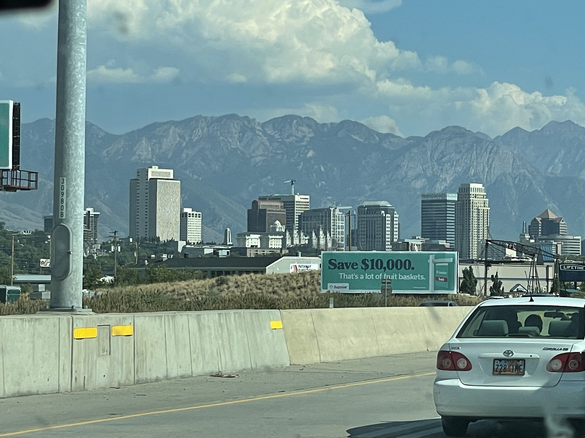
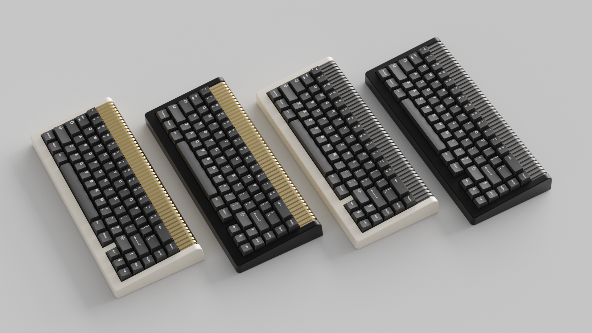

---
tags:
- ÆOLUS
slug: "/2021-08-14"
title: Project Updates - August 14th
date: 2021-08-014T00:00:00-06:00
description: ''
banner: ''
canonicalUrl: https://carsonwright.me/2021-08-014

---

Hey Everybody! This week has been pretty busy for me so I wasn't able to make any progress this week but I still have the information to share that I promised last week. I also wanted to add that I'll be done with my job next week and I'll be starting college full time, and honestly I don't know if that will mean I have more or less time for keyboards.

Also I'm in Salt Lake City this weekend.

***

## ÆOLUS

#### About

ÆOLUS is a 65% board inspired by a train of the same name, and is a collaboration between [MVKB](https://mvkb.com) and I. The board features a milled aluminum body, and brass weight. We're still working on it and we can't wait to share more details as we continue through the development process.

***

Other than that I don't have any more news to share this week. As usual, thank you guys for everything.

Carson
