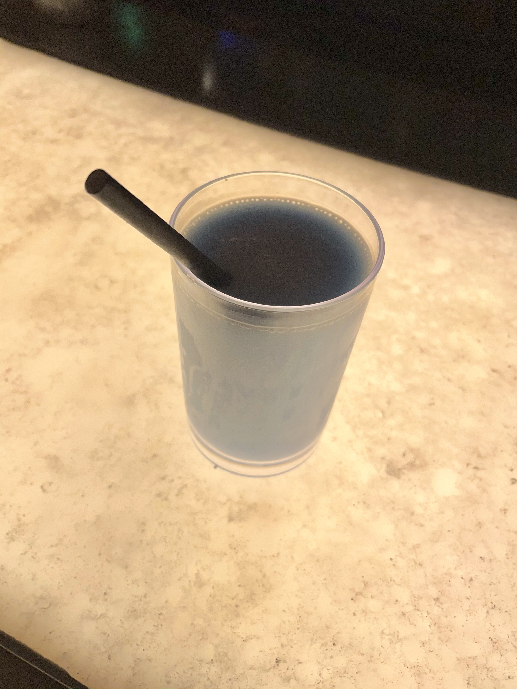

---
tags:
- KBD2600
- Parcel
- Divinity
slug: "/2021-07-24"
title: Project Updates - July 24th
date: 2021-07-24T00:00:00-06:00
description: ''
banner: ''
canonicalUrl: https://carsonwright.me/2021-07-24

---
Hello everybody! I'm currently on vacation in Southern California. Short aside, but we visited Disney Land last week and the blue milk is a MUST try. I'd highly recommend it.

I also had an oportunity to visit Otto at [Eon Machining](https://www.instagram.com/eon_machining/), the machinist for the KBD2600 and Parcel. We talked a lot about the boards and the manufacturing of them, he was also able to shed some more light on the aluminum situation and I wanted to share that with you guys here. With the world in aluminum shortage due to COVID19, many aluminum suppliers aren't taking on new clients. For most manufacturing this wouldn't be a problem since Otto has a reliable supplier for aluminum, however, since aesthetics are the main focus when it comes to keyboards, we have to use a different alloy than Otto's supplier on any board we plan to anodize. Farther down I'll highlight how this affects each upcoming board.

Here's the machine that will be responsible for making the KBD2600 and Parcel.

***

## KBD2600

#### Manufacturing

Because the KBD2600 will use an anodized finish we're unfortunately still stuck waiting for aluminum. Once the world wide aluminum situation stabilizes we'll be able to proceed with the KBD2600.

#### Design Revisions

During my meeting with Otto we went over some small design tweaks that will simplify the machining on the KBD2600 and therefore lower the price for you guys. The tweaks are all simple and won't have a substantial effect on the overall look of the board.

***

## Parcel

#### Status

Because of the aluminum situation I highlighted above, it makes sense to focus on Parcel for the time being. Parcel uses a powder coated finish meaning Otto is able to get aluminum that will work well with the finish. Starting next week I'll be putting my effort towards finishing the design of Parcel so we can hopefully start moving forward with the prototype for it.

***

## Divinity

#### Status

I'm also in talks with another vendor about running Divinity and I look forward to finishing up the design for it so we can move towards a prototype.

***

And that's about it for this week, thanks everybody!

Carson
