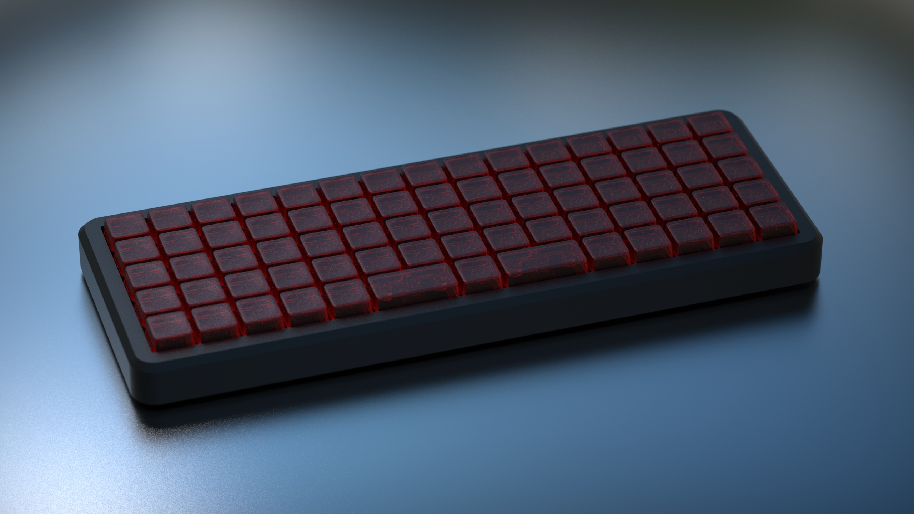
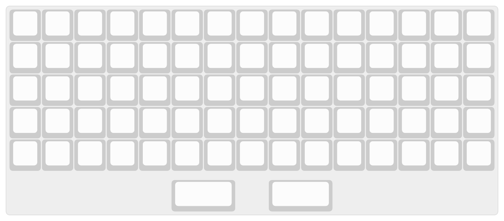
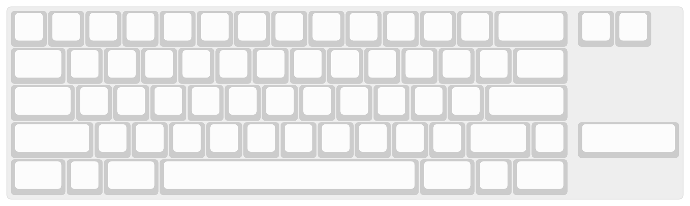

---
tags:
- KBD2600
- Parcel
- Divinity
slug: "/2021-07-31"
title: Project Updates - July 31th
date: 2021-07-31T00:00:00-06:00
description: ''
banner: ''
canonicalUrl: https://carsonwright.me/2021-07-31

---

Hey Gang, I'm finally back home which means... I'm gonna reveal Meteor!!!!!!

***

## Meteor

#### What is Meteor?

Meteor got started as a 60% ortho board, however, since I want enough copies to sell for this board to be affordable, it's going to be a 60% ortho and normal 60% board with a PCB and Plate combo to support both. I'll release some more renders next week once I have the time to make them, but in the meantime here's some information on the board.

#### Specs

Here are some of the specs for the board:

- Top Mounted
- 60%
- Anodized Aluminum
- Stainless Steel Weight
- Aluminum and Polycarbonate Plate

And here are the supported layouts:

#### What Is The Status Of The Meteor?

The design is almost completely finished and I'll be ordering a prototype as soon as I'm finished with the design.

#### Why Is This Board Skipping Ahead of My Other Boards

For this board I'm going with a local manufacturer, partially as an experiment, but mostly because this board is simple and I'm confident a non-keyboard manufacturer can handle this board.

#### How Can You Buy The Board?

There's gonna be a small private groupbuy to start with, that way I can ensure the quality meets my expectations and if an issue does come up I can afford to resolve said issue. After that I'll start transitioning towards a larger public groupbuy. Once the design for the board is done and I have the prototype in hand I'll start taking people for the private groupbuy, but I'll release more information on that the closer we get to the GB.

***

And that's about it for this week, as usual, let me know if you guys have any questions. I'm almost always available and always happy to talk.

Carson
