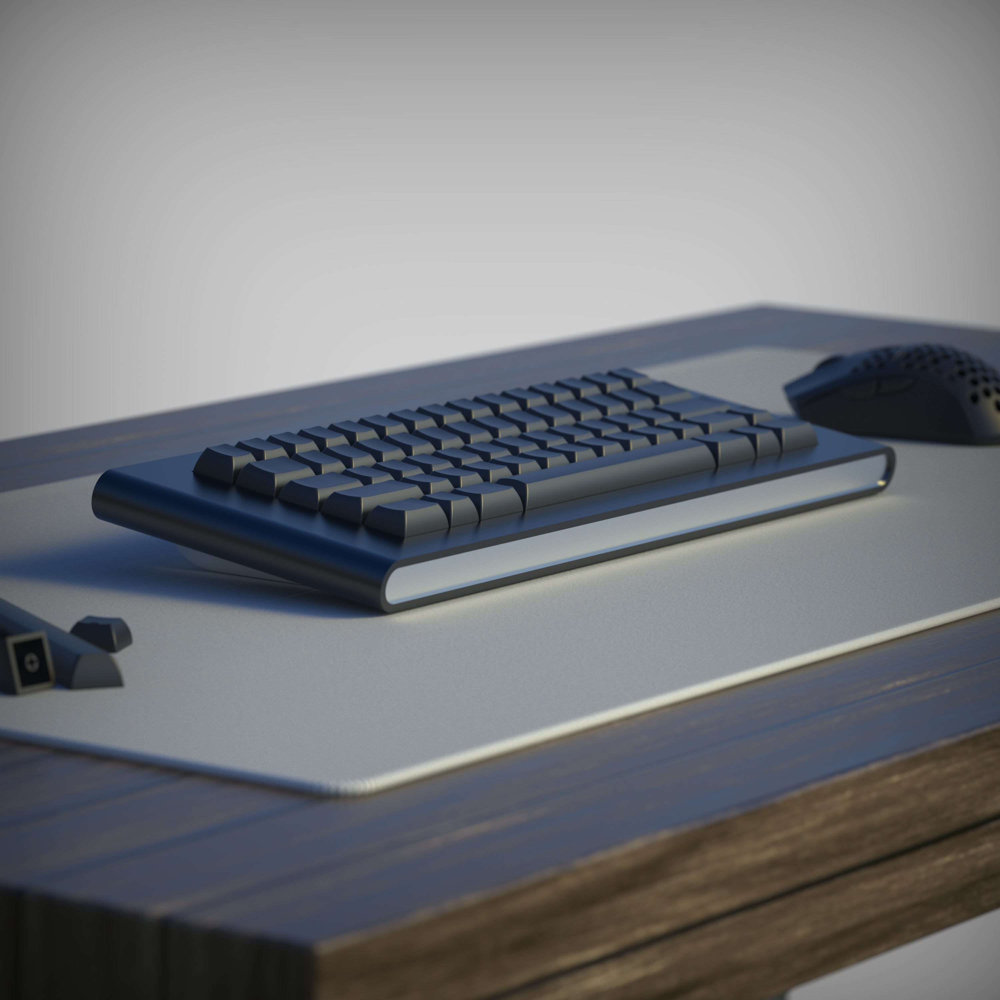

---
tags:
- KBD2600
- Parcel
- ACP
- Divinity
- Greenhouse
slug: "/2021-06-19"
title: Project Updates - June 19th
date: 2021-06-19T00:00:00-06:00
description: ''
banner: ''
canonicalUrl: https://carsonwright.me/2021-06-19

---
Hey everybody, this was my first week doing keyboard stuff semi-full time and I got a TON of stuff done. Unfortunately (at least this week), most of what went down was either behind the scenes stuff or collaborations that I can't share yet, but there will be more information on those in the coming weeks.

***
## Design Streams

This week was the first week of my design streams and I had a great time and can't wait to continue doing them. In future weeks I'm gonna mix the content up a little bit and we'll be doing some prototype builds, switch lubing and chatting, and maybe some guest appearances as well. The streams will also be on Saturday at 12:00 PM Pacific Time from now on since it sounded like a lot of people, understandably, had work and couldn't make it.

***

## KBD2600

#### Quotes/Prototype

Currently the manufacturer is waiting on a good quote for aluminum before proceeding with the quotes for the board itself.

***

## Parcel

#### Vendor

Right now it's looking like the vendor for Parcel is going to be the same vendor as the one for the KBD2600 (who I still can't reveal unfortunately).

***

## ACP

#### Sourcing Parts

The goal is to have all the parts for the ACP boards standardized and readily available to whoever wants them so I spent some time this week looking into suppliers for parts. Right now it's looking like I have a source lined up for the case feet, however, I'm still looking for a good source for the other parts.

***

## Divinity

#### About

I accidentally leaked this board on stream by setting it as the background for my starting soon section. I was planning on announcing it soon anyway, but now I'll just be announcing it a bit earlier than expected.

This board is in the tail end of the design phase so I have the majority of the concrete details hammered out. It will be a 60% but will have a TKL version follow shortly after, it will use a leaf-spring mounting system, and it will be made from anodized aluminum. Expect more renders and information in the weeks to come.

***

## Greenhouse

#### About

I worked on this board during Wednesday's stream, however, at the moment it's little more than a concept so once again, expect more information in the following weeks.

***

And that's about it for this week, thanks for everything guys :)

Carson
