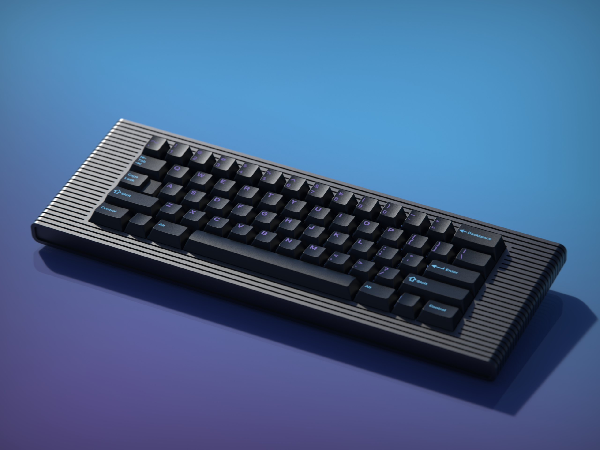

---
tags:
- KBD2600
- Parcel
slug: "/2021-05-15"
title: Project Updates - May 15th
date: 2021-05-15T00:00:00.000-06:00
description: ''
banner: ''
canonicalUrl: https://carsonwright.me/2021-05-08

---
Hey everybody!

This week's been very busy for me and I didn't get as much done as I'd hoped, however I still do have some news to share.

***

## KBD2600 News

#### Manufacturing

A few months back I made the decision that I wanted to try to manufacture the KBD2600 locally and because that may have an effect on you guys as consumers, I wanted to take a second and share my philosophy when it comes to manufacturing. When I'm looking for a manufacturer, I have three main priorities that I look for in the following order:

1. **Quality**

   When you pay as much for something as we often do for keyboards, it's important that the product meets the highest quality standard possible.
2. **Speed**

   I don't think it's fair for the customer to have to wait upwards of a year to receive something as is often the case in the world of mechanical keyboards.
3. **Price**

   Although people expect to spend a lot when purchasing keyboards, price is still an important factor and nobody wants to spend too much.

So why that order? To me, Quality comes first. I'm doing my best to ensure that any product meets the highest quality standards possible. As a designer selling products, I owe it to my customers to deliver a product that meets if not exceeds their expectation of quality. Second is speed. There have been countless times when I've been interested in purchasing a keyboard or other product and have decided against it because the expected ship date is six months to a year in the future. While somewhat understandable given the niche nature of this hobby, I still think it's ridiculous to make people wait a year to receive a product. And finally, price. I will never sacrifice quality and speed to lower price and increase profit for myself. I didn't start designing keyboards to get rich and I have no plans to get rich off of keyboards, I'm doing this out of a love of the hobby and I'm more than willing to sacrifice some profit in order to deliver a product that is a higher quality and arrives faster.

Due to these priorities, I think going with a local shop for the manufacturing will be best for the future of the board. It's not that I think Chinese shops don't make high quality parts. Chinese shops do a great job and are more than capable of delivering the same quality at a lower price, however, I think the value of having a face to face relationship with a manufacturer can't be overstated. Additionally, by manufacturing locally I'll hopefully be able to speed up delivery time since there won't be any need to ship overseas. With that being said, if none of the local machine shops meet my requirements, I'll be quoting a number of Chinese shops familiar with the mechanical keyboard community and going through one of them.

#### Finishing

In the event I do end up manufacturing in China, the board will likely be anodized (given it's color) there as well. However, if a local shop does end up working out for the manufacturing I'll need to anodize locally as well, so I took the time this week to visit a local anodizer and have a look around. Here are a few pictures of some of their samples.

***

That's about it for this week, next week will hopefully be a bit less busy and I'll have some more time to make progress on the KBD2600 and Parcel.

Carson
