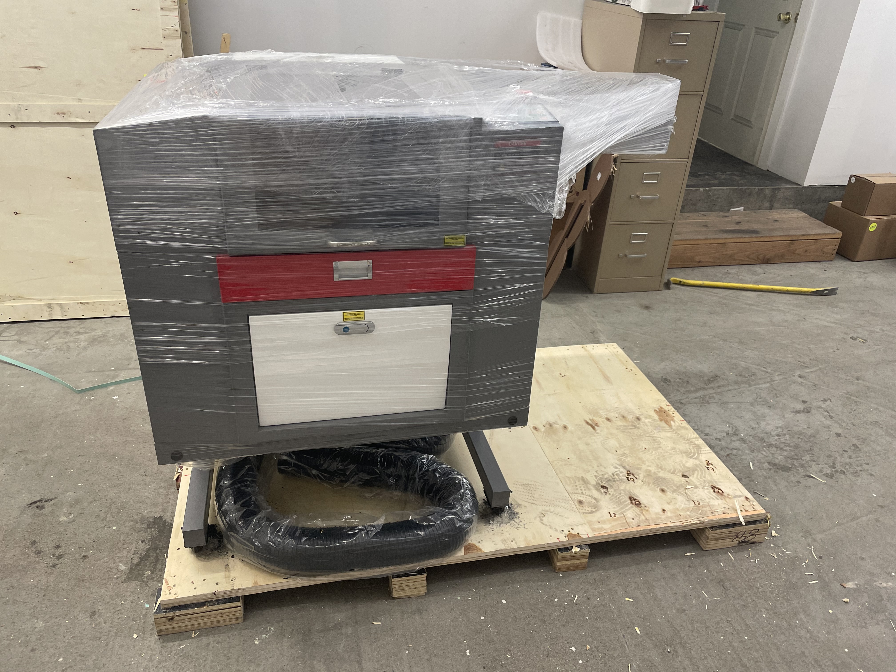

---
tags:
  - Meteor
  - ACP
  - Aeolus
  - KB Stand

slug: "/2021-09-05"
title: Project Updates - September 5th
date: 2021-09-05T00:00:00-06:00
description: ''
banner: ''
canonicalUrl: https://carsonwright.me/2021-09-05

---
Hey everybody! I want to take the time to announce a quick change today, from now on project updates will come on Sundays due to scheduling issues with school. In terms of keyboard news, I have a lot to share this week. First of all I started moving into a small office/shop which will make it easier for me to consolidate all my project stuff and will also give me the ability to do some light production work myself. Second, I got a laser cutter which will let me prototype for the Acrylic Case Project and will also let me prototype and produce the KB Stand.

***

## Meteor

This past week I started work on the technical drawings for Meteor which will let me get the qoute and prototype. I'm also doing the last little bits of required work before putting in the PCB order from China.

***

## Aeolus

I did some work on the back of Aeolus this week and I'll hopefully be wrapping up the internals in this coming week.

***

## Acrylic Case Project (ACP)

Now that I have the laser available I'll be cutting prototype cases for the ACP before releasing the open source case files.

***

## KB Stand

I'll also be cutting the KB Stand prototypes now that I have the laser available.

***

And that's it for this week, as usual, thanks for everything guys.

Carson
